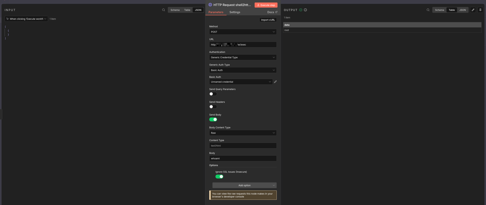
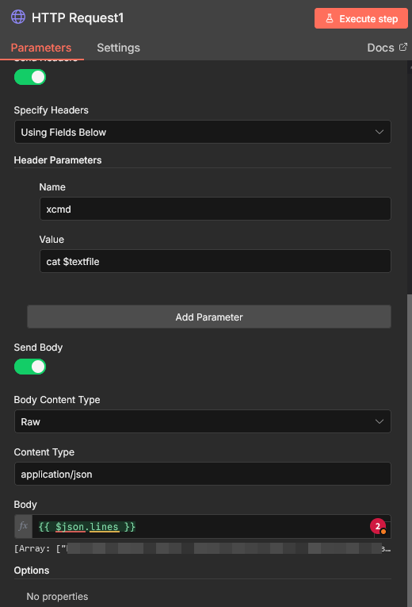

# 🚀 HTTP2Shell

<p align="center">
  
</p>

## Description

**HTTP2Shell** is a lightweight HTTP API server written entirely in **Bash** and powered by **socat**.  
It allows you to expose simple REST-like endpoints over HTTP for **remote command execution** and **system introspection**.

The tool is designed for **internal automation**, **DevOps tasks**, **red-team labs**, **CTF environments**, and **self-hosted admin utilities**.  
It is **not intended for public internet exposure**.

This tool was inspired by the article on Habr https://habr.com/ru/articles/796731/
.
I created this tool to solve a limitation I faced while automating Bug Bounty workflows in n8n. n8n does not allow saving shell command outputs larger than 1 MB when running commands directly. Previously, I had to first save the output to a file and then read it with another n8n node, which was inconvenient. Thanks to the insights from the article, I found a way to handle this problem more efficiently.

This tool will also be used in my other project, which is designed to work with n8n:
https://github.com/solo10010/Hacker-Toolbox

Key features:
- Pure Bash implementation (no frameworks)
- HTTP Basic Authentication
- Default and custom endpoints
- Optional remote command execution
- Uses system shell by default (or user-defined)
- Colored logs with optional disable
- Minimal dependencies


## Installation and Dependencies

### Dependencies
- `bash`
- `socat`
- Standard Unix utilities (`uptime`, `lsblk`, etc.)

### Install socat

**Debian / Ubuntu**
```bash
apt install socat
```

### Arch Linux

```bash
pacman -S socat
```

### RHEL / CentOS

```bash
yum install socat
```

### Install HTTP2Shell

```bash
git clone https://github.com/yourusername/http2shell.git
cd http2shell
chmod +x http2shell.sh
```

### How to Use

#### Start the server

```bash
./http2shell.sh
```

#### By default, the server:
 - Listens on 127.0.0.1:8007
 - Uses rest:api for Basic Auth
 - Enables /exec endpoint
 - Uses system shell ($SHELL → bash → sh fallback)

 ### Available options

 ```bash
    -h, --help              Show help
    -ip, --ip <ip>          Listen IP
    -port, --port <port>    Listen port
    -u, --user <user>       Basic auth user
    -p, --pass <pass>       Basic auth password
    --no-exec               Disable /exec endpoint
    -e, --endpoint          Add custom POST endpoint
    --no-color              Disable colored logs
```

### Usage Examples

#### Call default endpoints

Uptime

```bash
curl -u rest:api http://127.0.0.1:8007/api/uptime
```

Disk info

```bash
curl -u rest:api http://127.0.0.1:8007/api/disk
```

Remote command execution

```bash
curl -u rest:api -X POST http://127.0.0.1:8007/exec \
     -d "id"
```

Disable remote execution

```bash
./api-shell.sh --no-exec
```

Add custom endpoint

```bash
./api-shell.sh --endpoint /api/hello "ps aux"
```

Call it:

```bash
curl -u rest:api -X POST http://127.0.0.1:8007/api/hello
```

Disable colored output

```bash
./api-shell.sh --no-color
```

### Usage Examples N8N

This guide explains how to send commands to `shell2http` from n8n via HTTP requests.

---

## Setting Up an HTTP Request in n8n

- **Method:** `POST`  
- **URL:** `http://shell2http.offsec.pw/exec`  
- **Authentication:**  
  - Credential type → Basic Auth  
  - Username: `rest`  
  - Password: `api`  
- **Request Parameters:** DISABLED  
- **Request Headers:** DISABLED  
- **Request Body:** ENABLED  
  - Content type: "Raw"  
  - Content type value: `text/plain`  
  - Body example (your command):  
    ls -la

<p align="center">
  
</p>

---

### Example of command output `ls -la`

```json
[
{
"data": "total 32\ndrwxr-xr-x  4 root root 4096 Dec 14 20:47 .\ndrwxr-xr-x 19 root root 4096 Dec 14 20:43 ..\ndrwxr-xr-x  7 root root 4096 Dec 14 20:43 .git\ndrwxr-xr-x  2 root root 4096 Dec 14 21:36 assets\n-rwxr-xr-x  1 root root 6242 Dec 14 21:21 http2shell.sh\n-rw-r--r--  1 root root 4103 Dec 14 21:37 readme.md" 
}
]
```

Next, you can parse the output through the n8n node "Code in JavaScript" example of how to parse a command `ls -la`

```javascript
const raw = items[0].json.data;

// Split output into separate lines
const lines = raw.split('\n');

// Remove the "total" line and empty lines
const files = lines.filter(l => l && !l.startsWith('total'));

return files.map(line => ({
  json: {
    line
  }
}));
```

### You can download this example to import it into your n8n.

<p align="center">
  <a href="http2shell.json">
    
  </a>
</p>

# `/execf` — File-backed execution (HTTP2Shell)

## What is `/execf`

`/execf` is an execution endpoint designed to work with **large text inputs**  
(lines, lists, URLs, words, etc.) that need to be processed by standard Unix tools.

It is useful when:
- The input data is large (hundreds or thousands of lines)
- Passing data directly as command arguments is inconvenient or impossible
- You want to use tools like `grep`, `awk`, `sed`, `sort`, `uniq`, `waybackurls`

---

## How `/execf` works

1. Client sends a **POST** request with a JSON body
2. Server extracts **all string values from JSON arrays**
3. These strings are written **line-by-line** into a temporary file:

   ```
   /tmp/http2shell-<sha256>.txt
   ```

4. The file path is exported to the command as an environment variable:

   ```bash
   $textfile
   ```

5. The server executes the command provided in the `xcmd` HTTP header
6. The server returns a JSON response with execution results

---

## Request format

### Method
```
POST
```

### Endpoint
```
/execf
```

### Required HTTP header

| Header | Description |
|------|-------------|
| `xcmd` | Shell command that uses `$textfile` |

Example:
```text
cat $textfile | grep test
```

### Request body (JSON)

**Recommended format — array of strings**
```json
["line one", "line two", "test", "another line"]
```

**Also supported — nested JSON**
```json
[
  {
    "linesArray": ["one", "two", "three"],
    "count": 3
  }
]
```

All string elements found inside JSON arrays are written **one per line** into `$textfile`.

---

## Response format

```json
{
  "textfile": "/tmp/http2shell-acde1234.txt",
  "stdout": "command output\n",
  "stderr": "",
  "code": 0
}
```

| Field | Description |
|------|-------------|
| `textfile` | Path to temporary file |
| `stdout` | Standard output of the command |
| `stderr` | Standard error output |
| `code` | Command exit code |

---

## Examples (curl)

### Grep example
```bash
curl -u rest:api \
  -X POST http://127.0.0.1:8007/execf \
  -H 'Content-Type: application/json' \
  -H 'xcmd: cat $textfile | grep test' \
  --data-binary '["one","two","test","three"]'
```

### Sort and unique
```bash
curl -u rest:api \
  -X POST http://127.0.0.1:8007/execf \
  -H 'Content-Type: application/json' \
  -H 'xcmd: sort -u $textfile' \
  --data-binary '["b","a","b","c"]'
```

### Count lines
```bash
curl -u rest:api \
  -X POST http://127.0.0.1:8007/execf \
  -H 'Content-Type: application/json' \
  -H 'xcmd: wc -l < $textfile' \
  --data-binary '["a","b","c"]'
```

---

## n8n setup (short)

### HTTP Request node

- **Method:** POST
- **URL:** `http://127.0.0.1:8007/execf`
- **Authentication:** Basic Auth (`rest` / `api`)
- **Headers:**
  - `Content-Type: application/json`
  - `xcmd: cat $textfile | grep test`
- **Body:**
  - Type: `Raw`
  - Content-Type: `application/json`
  - Value:
    ```json
    {{ $json.lines }}
    ```


<p align="center">
  
</p>

---

## n8n example: generate lines (Code node)

```javascript
const text = `one
two
three
test
four`;

const lines = text
  .split('\n')
  .map(s => s.trim())
  .filter(Boolean);

return [{
  json: {
    lines,
    count: lines.length
  }
}];
```

---

## Timeouts

The server enforces time limits:

| Parameter | Description | Default |
|----------|-------------|---------|
| `BODY_TIMEOUT` | Request body read timeout | 10s |
| `CMD_TIMEOUT` | Command execution timeout | 20s |

- Body timeout → HTTP 408
- Command timeout → HTTP 504

---

## Notes

- `xcmd` must be ASCII-only (HTTP header limitation)
- Temporary file is removed after execution (current implementation)
- `/execf` is intended for trusted environments only

---

## Important Notes

- **Do not use query parameters** (e.g., `?exec=ls`) — the server only reads the **POST request body**.  
- Make sure to use **Basic Auth**, otherwise you will get a `401 Unauthorized` error.  
- For commands producing large output, `shell2http` is better than standard n8n shell nodes, as it **has no 1 MB output limit**.


## ⚠️ Security notice:
  - Run HTTP2Shell only in trusted environments. Never expose it directly to the public internet without additional protections (firewall, VPN, reverse proxy, IP filtering).
  - `/execf` allows arbitrary command execution.  
  Run HTTP2Shell **only in trusted environments** and never expose it directly to the public internet.
